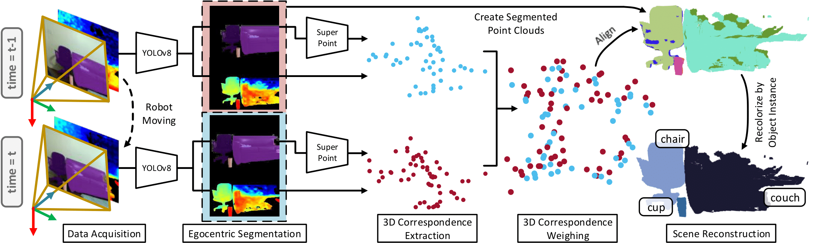
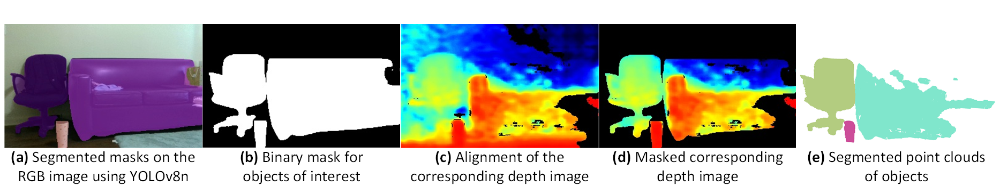
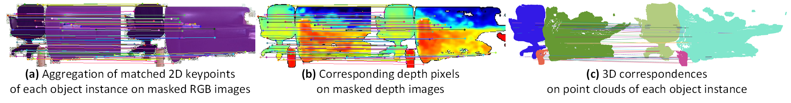
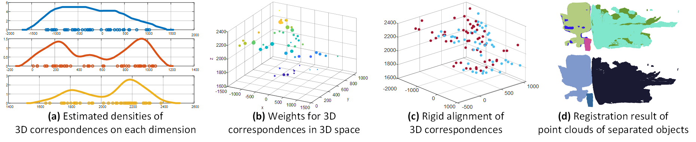
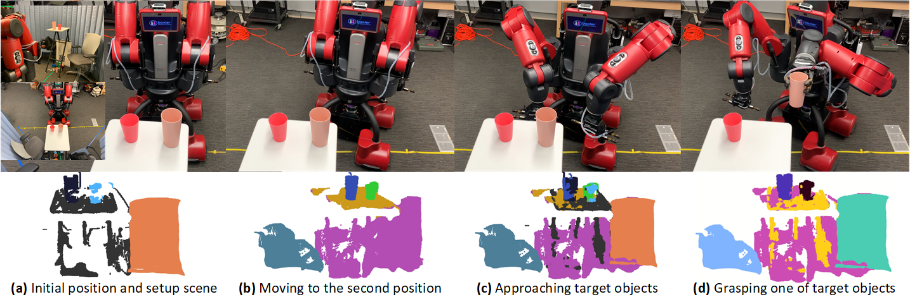

<!-- PAPER TITLE -->

# [ICRA '24] Real-Time 3D Semantic Scene Perception for Egocentric Robots with Binocular Vision

<!-- TABLE OF CONTENTS -->

<details>
  <summary>Table of Contents</summary>
  <ol>
    <li><a href="#authors">Authors</a></li>
    <li><a href="#abstract">Abstract</a></li>
    <li><a href="#prerequisites">Prerequisites</a></li>
    <li><a href="#pipeline-overview">Pipeline Overview</a></li>
    <li><a href="#egocentric-segmentation">Egocentric Segmentation, Feature Matching, and Point Cloud Alignment</a></li>
    <li><a href="#real-time-deployment-on-baxter-robot">Real-Time Deployment on Baxter Robot</a></li>
    <li><a href="#citing">Citing</a></li>
  </ol>
</details>

## Authors

<ol>
    <li><a href="https://mkhangg.com/">Khang Nguyen</a></li>
    <li><a href="https://www.tuandang.info/">Tuan Dang</a></li>
    <li><a href="https://www.uta.edu/academics/faculty/profile?username=huber">Manfred Huber</a></li>
</ol>

>  All authors are with Learning and Adaptive Robotics Laboratory, Department of Computer Science and Engineering, University of Texas at Arlington, Arlington, TX 76013, USA.

<!-- ABSTRACT -->

## Abstract

Perceiving a three-dimensional (3D) scene with multiple objects while moving indoors is essential for vision-based mobile cobots, especially for enhancing their manipulation tasks. In this work, we present an end-to-end pipeline with instance segmentation, feature matching, and point-set registration for egocentric robots with binocular vision, and demonstrate the robot's grasping capability through the proposed pipeline. First, we design an RGB image-based segmentation approach for single-view 3D semantic scene segmentation, leveraging common object classes in 2D datasets to encapsulate 3D points into point clouds of object instances through corresponding depth maps. Next, 3D correspondences of two consecutive segmented point clouds are extracted based on matched keypoints between objects of interest in RGB images from the prior step. In addition, to be aware of spatial changes in 3D feature distribution, we also weigh each 3D point pair based on the estimated distribution using kernel density estimation (KDE), which subsequently gives robustness with less central correspondences while solving for rigid transformations between point clouds. Finally, we test our proposed pipeline on the 7-DOF dual-arm Baxter robot with a mounted Intel RealSense D435i RGB-D camera. The result shows that our robot can segment objects of interest, register multiple views while moving, and grasp the target object. The demo is available at [YouTube](https://youtu.be/-dho7l_r56U).

<p align="center">
   <br/>
   <i>The GIF is played with x2 speed for small file size.</i>
 </p>

<!-- PREREQUISITES -->

## Prerequisites

* [KDEpy](https://github.com/tommyod/KDEpy) (version 1.1.5)
* [pyrealsense2](https://github.com/IntelRealSense/librealsense) (version 2.51.1.4348)
* [Open3D](https://github.com/isl-org/Open3D) (version 0.16.0)

To install all requirements, please run the command line below:

```
pip install -r requirements.txt
```

Please check the [config/config.yaml](config/config.yaml) file before running. Variable `'device'` in the file also allows to change the processing unit for segmentation model inference (GPU or CPU).

<!-- PIPELINE OVERVIEW -->

## Pipeline Overview

The 3D semantic scene perception pipeline when the robot takes two (or multiple) views of a scene includes (1) egocentric segmentation to create point clouds of objects of interest, (2) extracting and matching corresponding features on masked RGB images to infer 3D correspondences via depth maps, (3) finding optimal transformations based on weighted 3D correspondences and reconstructing the 3D scene, and (4) returning the aligned point cloud from multiple views with segmented objects.

<p align="center">
   <br/>
   <i>Overview of Pipeline when Robot Moving in an Indoor Envinronment.</i>
 </p>

<!-- EGOCENTRIC SEGMENTATION, FEATURE MATCHING, & POINT CLOUD ALIGNMENT -->

## Egocentric Segmentation, Feature Matching, and Point Cloud Alignment

### Egocentric Segmentation

The egocentric object segmentation process includes **(a)** segmenting masks on the RGB image using YOLOv8n segmentation model, **(b)** obtaining and aggregating binary masks of the objects of interest, **(c)** aligning the corresponding depth image, **(d)** rectifying non-masked depth pixels on the aligned depth image with obtained masks, and **(e)** creating point clouds of such objects.

<p align="center">
   <br/>
   <i>Egocentric Object Segmentation Procedure.</i>
 </p>

### Feature Matching

The 3D correspondences matching process includes **(a)** extracting and matching keypoints between masked RGB images, **(b)** finding corresponding depth pixels on rectified depth images, and **(c)** mapping 3D correspondences between point clouds of object instances.

<p align="center">
   <br/>
   <i>3D Correspondences Matching Procedure.</i>
 </p>

### Point Cloud Alignment

The point cloud alignment process includes **(a)** dimension-wise estimating densities of 3D correspondences along x-axis (blue), y-axis (orange), and z-axis (yellow), **(b)** computing weights for 3D correspondences, **(c)** solving for the optimal rigid transformation based on 3D correspondences and their weights, and **(d)** aligning point clouds *(top)* with re-colorization based on each object instance *(down)*.

<p align="center">
   <br/>
   <i>The Point Cloud Aligment Procedure.</i>
 </p>

## Real-Time Deployment on Baxter Robot

We mount the Intel RealSense D435i RGB-D camera on the display of the Baxter robot. The Baxter robot firsts stands in one position, captures the scene at that view, moves to another position of 20-degree displacement and captures the scene at the scond view, and grasps one of the plastic cups. All the source code for the deployment procedure is in [deployment/main_pc](/deployment/main_pc) and [deployment/base_pc](/deployment/base_pc) folders.

<p align="center">
   <br/>
   <i>Action Sequence of Baxter Robot and Result at Each Step.</i>
 </p>

Experiment setup with *(top)* the Baxter **(a)** observing the scene at its first view, **(b)** moving to and capturing the second scene of 20-degree displacement, **(c)** approaching the target objects, and **(d)** grasping one of them; and *(down)* results at each step in our pipeline.


**NOTE:** For training SuperPoint with positional embedding using PyTorch, please refer to the [superpoint_with_pos_embed/](/superpoint_with_pos_embed/) folder. This is the incremental development based on [Shao-Feng Zeng](https://blog.csdn.net/zsfcg)'s [GitHub repository](https://github.com/shaofengzeng/SuperPoint-Pytorch). Give him a star when you use his code for your work! 

## Citing

```

```
